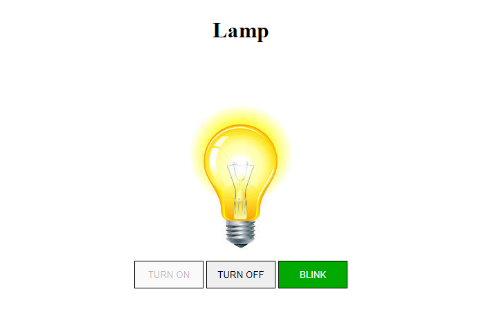

# interactive-lamp-js

Site created with the didactic purpose for the PWFE classes of the Systems Development course at [SENAI Jandira](https://jandira.sp.senai.br/), about the guidance of professor [Fernando Leonid](https://github.com/fernandoleonid)

The project consists of creating a light bulb that has three actions, turn on, turn off, and break (using various events for making).

The code was built with best practices in mind, such as single responsibility, and pure roles.

